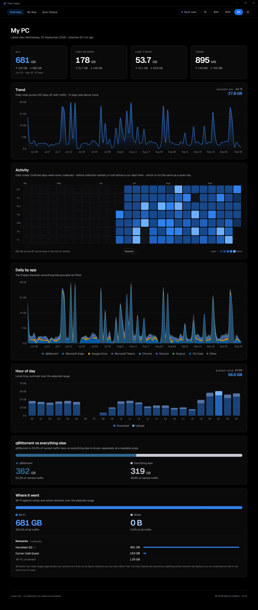
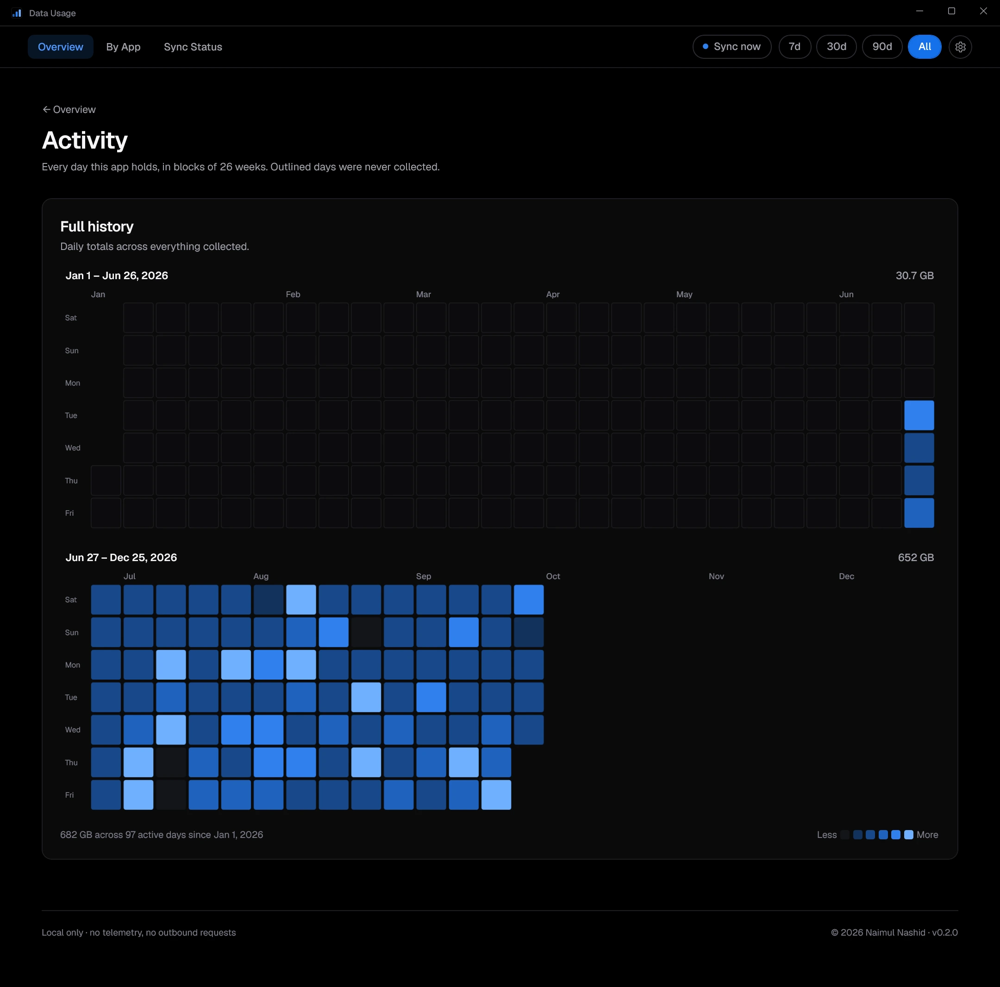
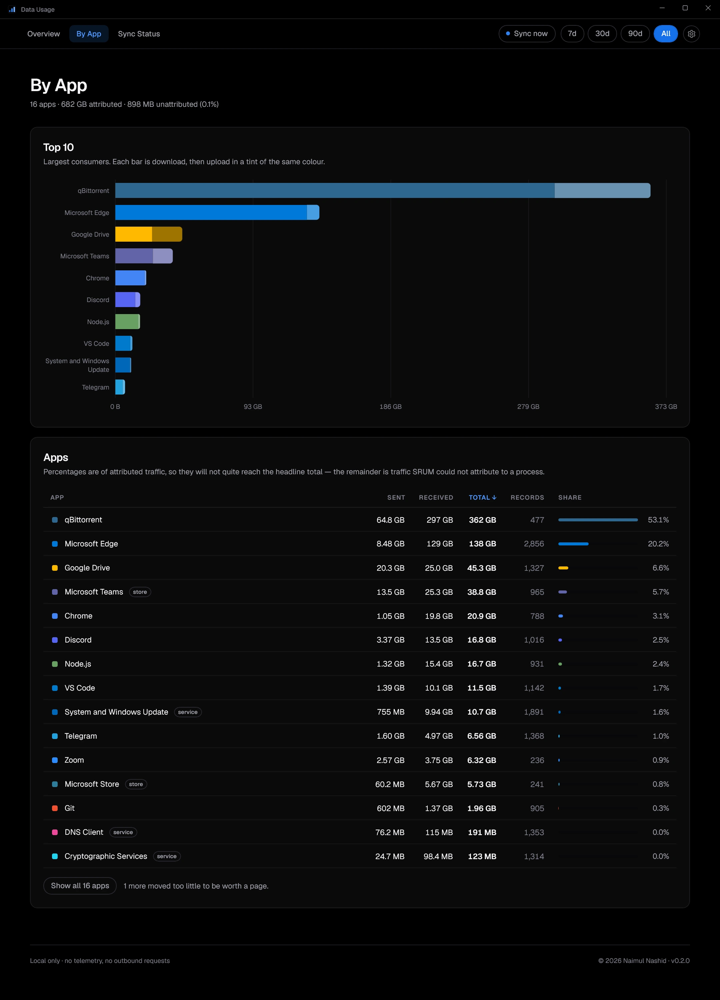
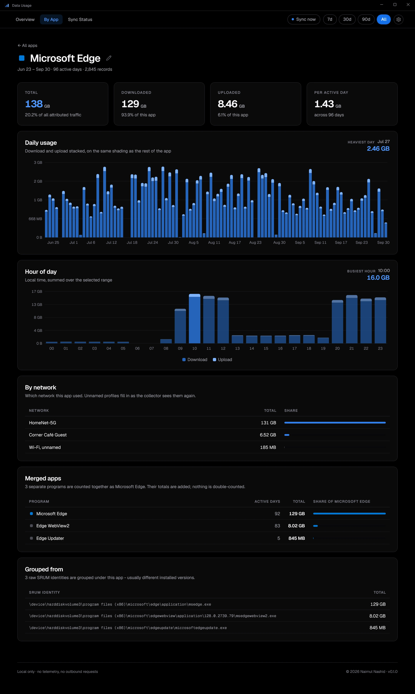
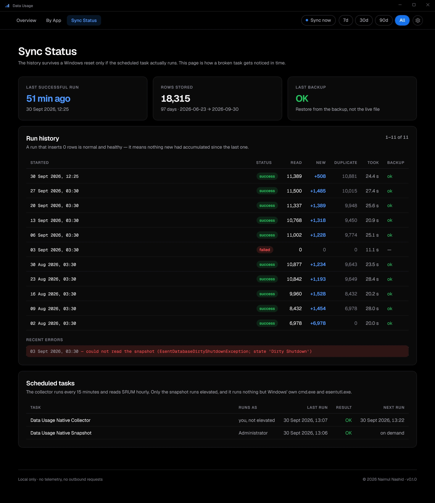

# Data Usage (native)

[](https://github.com/naimulnashid/data-usage-native/actions/workflows/ci.yml)
[](https://github.com/naimulnashid/data-usage-native/releases/latest)
[](LICENSE)

A native Windows app that keeps a **permanent history of how much data each
app on this PC uses**. Windows already measures it (Settings → Network &
Internet → Data usage) but keeps only a month or two, and a Windows reset
erases even that. This app copies it out every hour into a database on
another drive, so the history survives.

Built with WinUI 3 on .NET 10. A native port of the
[Data Usage Dashboard](https://github.com/naimulnashid/data-usage-tracker) web
app, sharing its design and its rules but no code. Local only: no network
calls, no server, no account.

## What it shows

- **Overview**: all-time, 30-day, 7-day and latest-day totals (up and down);
  the daily trend with the heaviest day and days well above trend; a six-month
  activity heat map (Expand for the full history); daily traffic by app; hour
  of day; an optional "one app vs everything else" split; and **where it went**
  - Wi-Fi against wired, and per network.
- **By App**: the top 10 as download/upload bars, and every app with its share.
  Apps with enough history open a detail page: daily usage, hour of day, by
  network, the programs merged into it, and the raw identities behind it.
- **Sync Status**: whether collection is actually running, the run history, and
  the two scheduled tasks as Windows reports them.

Range chips (7d / 30d / 90d / All) apply to every page.

## Screenshots

Every page, top to bottom, on an invented history (`datausage demo-data`) -
nobody's real usage.

<details open>
<summary><b>Overview</b> - totals, trend, activity, daily by app, hour of day, the split, where it went</summary>



</details>

<details>
<summary><b>Activity</b> - the full history as a heat map, in 26-week blocks</summary>



</details>

<details>
<summary><b>By App</b> - the top 10 as download/upload bars, and every app with its share</summary>



</details>

<details>
<summary><b>App detail</b> - daily usage, hour of day, by network, merged programs, raw identities</summary>



</details>

<details>
<summary><b>Sync Status</b> - last run, run history with errors, and both scheduled tasks</summary>



</details>

## Install

Windows 10 (version 2004 or later) or Windows 11, x64.

**From a release** (nothing else to install): download
`DataUsage-<version>-win-x64.zip` from
[Releases](https://github.com/naimulnashid/data-usage-native/releases), extract
it, and in that folder run:

```powershell
powershell -ExecutionPolicy Bypass -File .\Install.ps1
```

**From source**: needs the [.NET 10 SDK](https://dotnet.microsoft.com/download).
In a clone:

```powershell
powershell -ExecutionPolicy Bypass -File tools\Install.ps1
```

Either way it installs a self-contained build to `%LOCALAPPDATA%\Programs\Data Usage`,
adds **Data Usage** to the Start menu and to **Settings → Apps → Installed
apps** (and Control Panel's Programs and Features), sets the data folder
(`-DataDir`, default `D:\PersistentData\data-usage-native`; with no `D:` drive
the app asks on first run), and registers two scheduled tasks. Windows asks for administrator approval once, for the tasks.

**Keep the data folder off the Windows drive**, ideally in a folder a cloud
client backs up: that is what makes the history survive a reset.

**Uninstall** from Installed apps, or `Install.ps1 -Uninstall`. Your
history is never deleted.

**After a Windows reset**, reinstall with `-DataDir` pointing at the same
folder. Everything collected before the reset is still there.

## How collection works

- **Data Usage Native Collector** runs every 15 minutes, unelevated and without
  a window. It records which network the PC is on, and once an hour reads
  Windows' usage database (SRUM) into the history, then writes a consistent
  backup beside it.
- **Data Usage Native Snapshot** is the one step that needs Administrator: a
  shadow copy of the locked SRUM file. It runs only Windows' own `cmd.exe` and
  `esentutl.exe`, with arguments fixed when you approved the install. The
  collector starts it on demand; no prompt appears.

SRUM is read with Windows' own database engine (`esent.dll`), so no extra tools
are needed.

## Using it

- **Zoom** like a browser: **Ctrl+Plus**, **Ctrl+Minus**, **Ctrl+mouse wheel**,
  **Ctrl+0** to reset (50 % to 200 %, remembered). Also in the settings menu.
- **Sync now** (top bar or tray) collects immediately.
- **Tray**: closing the window keeps the app in the notification area, with the
  latest day's traffic in its tooltip. Right-click it for Sync now, the options
  and Exit.
- **Notifications** when a collection fails or collection stalls (settings or tray).
- **Start at login**: settings menu or tray. It starts straight to the tray.
- **Rename an app, or change its colour**: the pencil beside its name (hover a
  table row). Pick a colour or type its hex code; "Default colour" goes back.
  Both are stored with the history.
- **Light or dark**: Settings > Theme, or follow Windows' setting.
- **Click a Top 10 bar** to open that app's page.
- **Logos**: in the same pencil menu choose **Set logo…**, or drop an image on
  the app's name. Files live in the data folder's `logos\`, named after the
  app (`Bitwarden.svg`); dropping files there works too.
- **This PC…** in the settings menu sets the name on the overview and which app,
  if any, is split out from everything else.

The app always opens maximised.

## Why the total can differ from Windows

Windows' Data usage page shows **one network at a time**. The totals here cover
every network, so they are higher whenever the PC has used more than one. The
per-network rows under "Where it went" are the figures to compare.

## Development

```powershell
dotnet build DataUsageNative.slnx
dotnet test --project tests\DataUsage.Core.Tests\DataUsage.Core.Tests.csproj
dotnet run --project src\DataUsage.Cli -- stats           # totals and top apps
dotnet run --project src\DataUsage.Cli -- demo-data demo-data   # an invented history
& tools\Capture-Views.ps1 -Views 'overview=overview,0' -FullPage 1440
```

`dotnet run --project src\DataUsage.Cli -- read-srum <snapshot> --csv <SrumECmd csv>`
checks the SRUM reader field by field against
[SrumECmd](https://ericzimmerman.github.io/)'s output for the same file.

## License

[MIT](LICENSE). Geist is © Vercel, under the SIL Open Font License
(`src/DataUsage.App/Assets/Fonts/OFL.txt`).
